# Election_Analysis

## Analysis Overview
The 'Election Analysis' report was request by a Colorado Election Commmission Board for a breakdown of the voter turnout for each county, percentage of votes from each county out of the total count, and the county with the highest turnout.  For this analysis, the below were the specified requirements asked.

1. Calculate the total number of votes cast.
2. Calculate the total number of votes from each county.
3. Calculate the percentage of votes from each county.
4. Get a complete list of candidates who received votes.
5. Calculate the total number of votes each candidate received.
6. Calculate the percentage of votes each candidate won.
7. Determine the winner of the election based on popular vote.

## Resources
- Data Source: election_results.csv
- Software: Python 3.6.1, Visual Studio Code, 1.38.1

## Election Audit Results
The analysis of the election show that (shown in **Figure 1**):
- There were "369,711" votes cast in the election.'
- The counties that casted votes:
  - Jefferson votes comprised of "10.5%" of the votes and "38,855" number of votes.
  - Denver votes comprised of "82.8%" of the votes and "306,055" number of votes.
  - Arapahoe votes comprised of "6.7%" of the votes and "24,801" number of votes.
- The largest county turnout:
  - Denver
- The candidates were:
  - Charles Casper Stockham
  - Diana DeGette
  - Taymon Anthony Doane
- The candidate results were:
  - Charles Casper Stockham received "23.0%" of the votes and "85,213" number of votes.
  - Diana DeGette received "73.8%" of the votes and "272,892" number of votes.
  - Taymon Anthony Doane received "3.1%" of the votes and "11,606" number of votes.
- The winner of the election was:
  - Candidate Diana Degette, who received "73.8%" of the vote and "85,213" number of votes.

**Figure 1** - Election Results

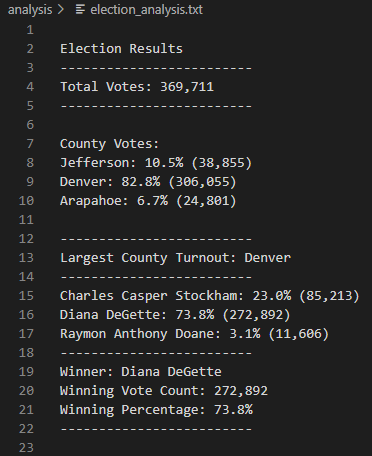

## Python Code
In this section, we will go over the Python code that was used to extract the data from the given 'CSV' from the Election Commission Board and calculate the given totals and percentages that we have seen above.

#### Total Votes
**Figure 2** - Total Votes

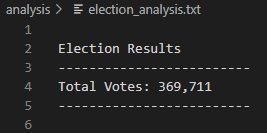

To calculate the total votes that were cast in this congressional election seen in **Figure 2**, the given *election_results.csv* needed to be loaded first so Python had a reference point to pull the necessary data seen in **Figure 3**.

**Figure 3** - Election Results CSV Example

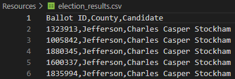

Next, a variable was created on *line 14* to initialize the vote counter and it was set to zero.  On *lines 37-47* Python is instructed to open the *election_results.csv* and read the data as a variable called *election_data* and to read the header information in each column but to skip it as data used for votes. Reference **Figure 4**.

**Figure 4** - Python Total Votes

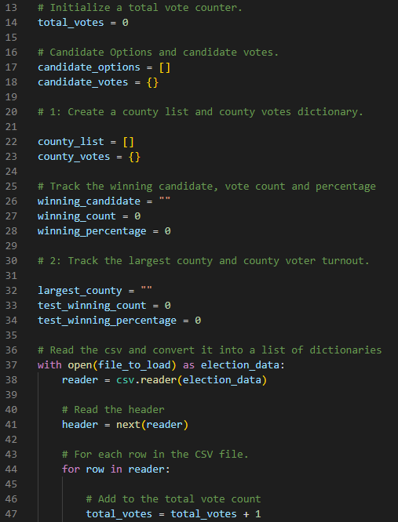

In order for the total votes to be printed out and saved, Python was instructed to open a text file called *election_analysis.txt* on *line 83*, a variable called *election_results* on *line 86* was created to house the total votes and print to the text file, and on *line 94* to save the total votes and the printed information to the *election_results.txt*. Reference **Figure 5**.

**Figure 5** - Python Total Votes Print Ouput and Save

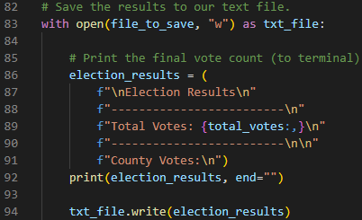

#### County Votes and Percentages of Votes
**Figure 6** - County Votes and Percentages of Votes

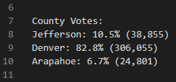

For Python to get the votes and percentages of votes for each county, a '_for_' loop needed to be created.  On _line 97_ a '_for_' loop is created to pull county names from an earlier written '_if_' statement and check for every time a specific county is seen in the CSV file to count each vote.  In _lines 99-107_, Python is instructed to pull the number of votes per county and to calculate a percentage of the total number received which then is printed as output and saved in the text file of each county as their own unique percentage and votes against the total votes overall cast. Reference **Figure 7**.

**Figure 7** - Python County Votes and Percentages of Votes

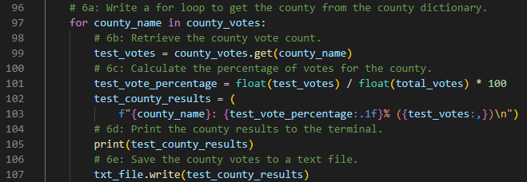

#### Largest County Turnout
**Figure 8** - Largest County Turnout

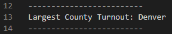

The 'Largest County Turnout' was written in Python as an '_if_' statement within the above-mentioned '_for_' loop on _lines 110-113_.  This told Python that for every vote per county that is greater than the winning count save them as the highest until you finish the loop.  In other words, save the county with the highest votes and only that county.  Additionally on the '_if_' statement on line 110, Python was instructed with an '_and_' for the percentage of votes to function similarly to the votes at the beginning of the '_if_' statement.  Lines 116-123 instructed Python on how to print and save the output to the _election_analysis.txt_. Reference **Figure 9**.

**Figure 9**

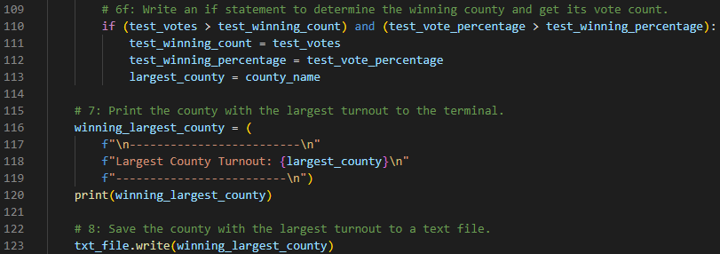

#### Candidate Votes and Percentages of Votes
**Figure 10** - Candidate Votes and Percentages of Votes

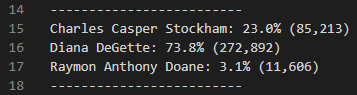

For Python to get the votes and percentages of votes for each candidate, a '_for_' loop needed to be created which is of a similar pattern that was seen earlier with county votes and percentages of votes.  On _line 126_ a '_for_' loop is created to pull county names from an earlier written '_if_' statement and check for every time a specific candidate is seen in the CSV file to count each vote.  In _lines 129-137_, Python is instructed to pull the number of votes per candidate and to calculate a percentage on the total number received which then is printed as an output and saved in the text file of each county as thier own unique percentage and votes against the total votes overall casted. Reference **Figure 11**.

**Figure 11** - Python Candidate Votes and Percentages of Votes

#### Winning Candidate
** Figure 12** - Winning Candidate

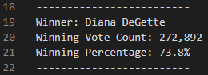

The winning candidate was written in Python as an '_if_' statement within the above-mentioned '_for_' loop on _lines 126-137_ which is of a similar pattern that was seen earlier with the largest county turnout.  This told Python that for every vote per candidate that is greater than the winning count save them as the highest until you finish the loop.  In other words, save the candidate with the highest votes and only that candidate.  Additionally on the '_if_' statement on line 140, Python was instructed with an '_and_' for the percentage of votes to function similarly to the votes at the beginning of the '_if_' statement.  Lines 146-155 instructed Python on how to print and save the output to the _election_analysis.txt_. Reference **Figure 9**.

**Figure 13** - Python Winning Candidate

## Election Audit Summary

As a proposal, this Python script can be used in any future county elections to gather the same data seen in this analysis with augmentation to the script.  My recommendation on how that is accomplished is seen below:

1. 
